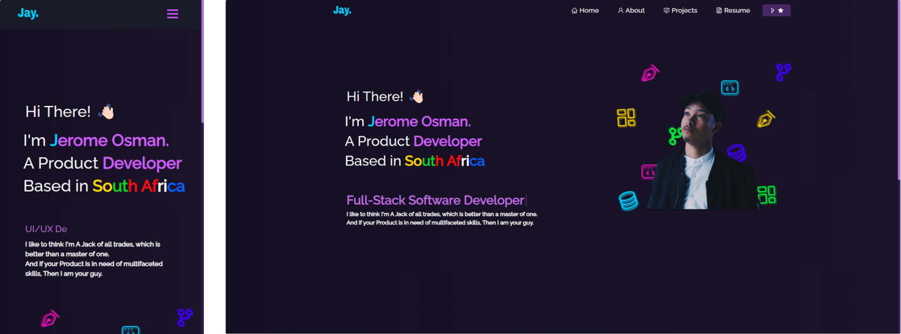

  
   

  <h3><b>WebDevJay Portfolio</b></h3>

# 📗 Table of Contents

- [📗 Table of Contents](#-table-of-contents)
- [📖 About the Project](#about-project)
  - [🚀 Live Demo ](#-live-demo-)
  - [🛠 Built With ](#-built-with-)
    - [Tech Stack ](#tech-stack-)
    - [Key Features ](#key-features-)
  - [👥 Authors ](#-authors-)
    - [👤 Jerome](#-jerome)
  - [🔭 Future Features ](#-future-features-)
  - [🤝 Contributing ](#-contributing-)
  - [⭐️ Show your support ](#️-show-your-support-)
  - [📝 License ](#-license-)

  
   

# 📖 WebDevJay | Portfolio 

**WebDevJay | Portfolio** is a personal portfolio Project was built using, React.js, Node.js, Express.js, CSS3, VsCode
## 🚀 Live Demo 

- Front-end deployed website: [WebDevJay Live Demo](https://github.com/187jjay187/WDJ)
-  **Password: WebDevJay**

(<a href="#readme-top">back to top</a>)

## 🛠 Built With 

- Figma (UX/UI Design)
- Adobe Suite(Graphic Design)
- React.js
- Node.js
- Express.js
- CSS3
- VsCode

### Tech Stack 

- JavaScript
- React.js
- Node.js
- Express.js
- CSS3

<!-- Features -->

### Key Features 

- **Hero Section typewriter Title**
- **About Page Grid Tech Stack**
- **Projects display page**
- **Downloadable Resume PDF Preview Page**

(<a href="#readme-top">back to top</a>)

## 👥 Authors 

### 👤 Jerome

- GitHub: [@githubhandle](https://github.com/187jjay187)
- Twitter: [@twitterhandle](https://twitter.com/187jjay187)
- LinkedIn: [LinkedIn](https://linkedin.com/in/jerome-osman-137605a4)

(<a href="#readme-top">back to top</a>)

## 🔭 Future Features 

- [ ] **Better Animations**
- [ ] **Theme Revamp with light & dark mode switch**
- [ ] **Carosel PDF Pages**
- [ ] **Graphic Design Portfolio**

(<a href="#readme-top">back to top</a>)

## 🤝 Contributing 

Contributions, issues, and feature requests are welcome!

Feel free to check the [issues page](https://github.com/187jjay187/WDJ/issues).

(<a href="#readme-top">back to top</a>)

## ⭐️ Show your support 

Give a ⭐️ if you like this project!

(<a href="#readme-top">back to top</a>)

## 📝 License 

This project is [LICENSE](./LICENSE.md) licensed.

(<a href="#readme-top">back to top</a>)

